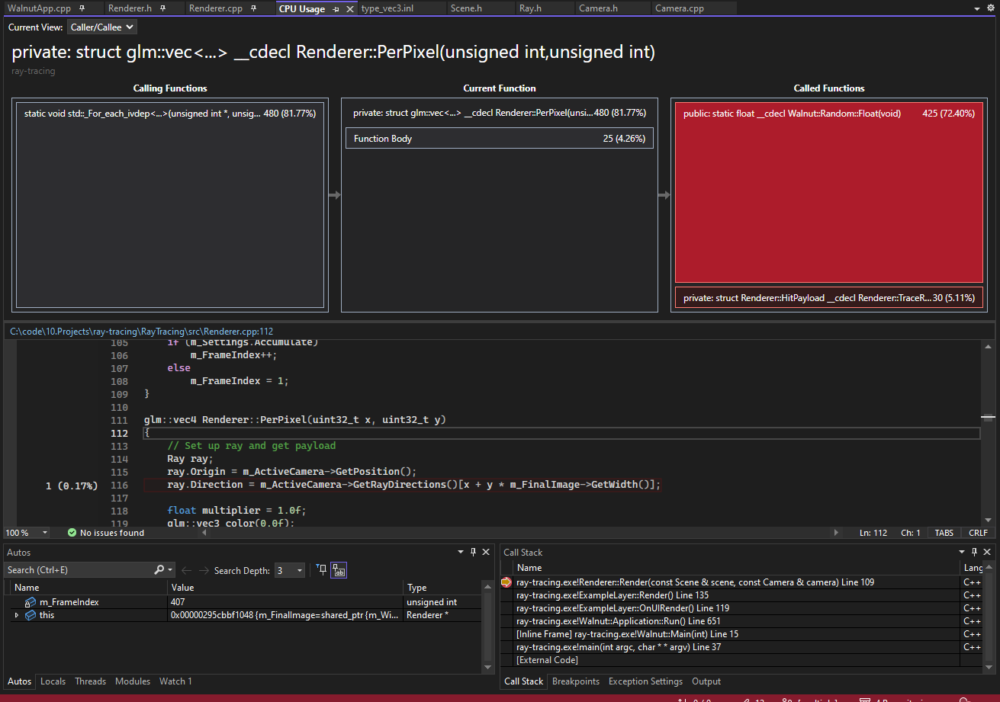

# Desktop Ray Tracer

Program to practice with desktop graphics and study 3d math. Currently renders spheres with a fixed lighting source. The spheres attributes are changeable in real-time and the camera can also move.

## Getting Started

1. To use, first download and install the Vulkan SDK: https://vulkan.lunarg.com/
2. Clone the repo
3. Run setup.bat located in Scripts
4. Compile and run the program

### Performance

Current render time with built-in multithreading (for loop) on my computer is 48-50ms per frame. This spawns way too many threads and performance in lost in overhead. Additionally, significant time is spent coming up with randoms for the scene accumulation (see screen shot below)

By pre-calculating the random vectors on initialization, render time is decreased to 7-8ms per frame. Currently this is done with a predictive random scheme. Randoms are stored in the RandomProvider class with one thread committed to re-caluculating the randoms. Randoms are then retrieved as needed and updated at a much slower rate than generating a new random each frame. This has the side effect of causing weird artifacts when resetting the frame accumulator, as many shaders are receiving the same random value for roughness offset.

### To Do

1. Move rendering from CPU to GPU
2. Add ability to render objects other than spheres
