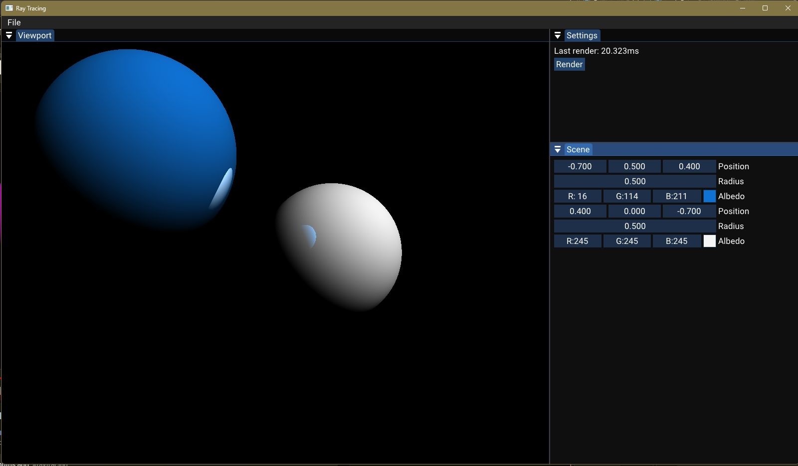

# Desktop Ray Tracer

Program to practice with desktop graphics and study 3d math. Currently renders spheres with a fixed lighting source. The spheres attributes are changeable in real-time and the camera can also move.

## Getting Started

1. To use, first download and install the Vulkan SDK: https://vulkan.lunarg.com/
2. Clone the repo
3. Run setup.bat located in Scripts
4. Compile and run the program

### Performance

Current render time single-threaded is about 60ms on an i7-12700k. Comes down to about half with C++ built in multi-threading. This spawns way too many threads and performance in lost in overhead. Additionally, significant time is spent coming up with randoms for the scene accumulation.

### To Do

1. Improve performance
   1. Change random to predictive directions for roughness calculation
   2. Change multi-threading scheme to use groups aware of how many cores CPU has
2. Move rendering from CPU to GPU
3. Add ability to render objects other than spheres
